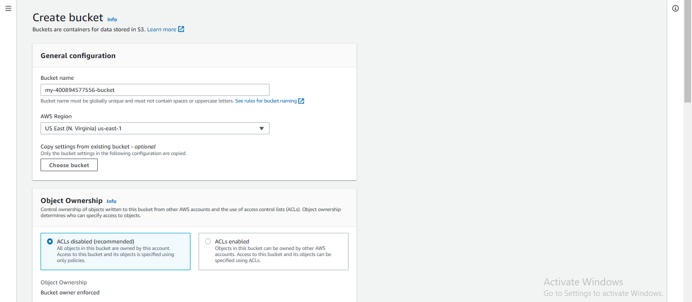

## **Deploy Static Website on AWS**

<!-- TABLE OF CONTENTS -->

  
Table of Contents

  <ol>
    <li>
      <a href="#about-the-project">Project Overview</a>
      <ul>
        <li><a href="#built-with">Frameworks</a></li>
      </ul>
    </li>
    <li>
      <a href="#getting-started">Getting Started</a>
      <ul>
        <li><a href="#prerequisites">Prerequisites</a></li>
        <li><a href="#steps">Create S3 Bucket</a></li>
        <li><a href="#steps">General configuration</a></li>
        <li><a href="#steps">Public Access settings</a></li>
        <li><a href="#steps">Bucket Versioning and Encryption</a></li>
        <li><a href="#steps">Upload File/Folders to the Bucket</a></li>
        <li><a href="#steps">Secure Bucket via IAM</a></li>
        <li><a href="#steps">Enable Static Website Hosting</a></li>
        <li><a href="#steps">Create Distribution</a></li>
        <li><a href="#steps">Access Website in Web Browser</a></li>
      </ul>
    </li>
    <li><a href="#contact">Contacts</a></li>
    <li><a href="#acknowledgments">Acknowledgments</a></li>
  </ol>

## Project Overview

The cloud is perfect for hosting static websites that only include HTML, CSS, and JavaScript files that require no server-side processing. The whole project has two major intentions to implement:

- Hosting a static website on S3 and
- Accessing the cached website pages using CloudFront content delivery network (CDN) service. Recall that CloudFront offers low latency and high transfer speeds during website rendering.

Note that Static website hosting essentially requires a public bucket, whereas the CloudFront can work with public and private buckets.

In this project, you will deploy a static website to AWS by performing the following steps:

1. You will create a public S3 bucket and upload the website files to your bucket.
2. You will configure the bucket for website hosting and secure it using IAM policies.
3. You will speed up content delivery using AWS’s content distribution network service, CloudFront.
4. You will access your website in a browser using the unique CloudFront endpoint.

## Getting Started

## Prerequisite

- Amazon Account
- An **udacity-starter-website** codebase on local machine

## 1. Create a Bucket

Navigate to the S3 dashboard, and click on the Create bucket button. It will launch a new wizard

We create a bucket first, and later we upload files and folders to it.

## 2. General configuration

Provide the bucket-name. The bucket name must be unique worldwide e.g. demo-bucket-2022-12-09, and must not contain spaces or uppercase letters.

## 3. Public Access settings

Allow all public access.

## 4. Bucket Versioning and Encryption

- Bucket Versioning - Keep it disabled.

- Encryption - If enabled, it will encrypt the files being stored in the bucket.

- Object Lock - If enables, it will prevent the files in the bucket from being deleted or modified

The snapshot below shows that the bucket is in the Region: US East (N. Virginia) us-east-1, and it has a unique Amazon resource name (ARN): **arn:aws:s3:::my-400894577556-bucket/index.html**. You can view more details of the bucket.

## 5. Upload File/Folders to the Bucket

In the snapshots above, we have created a public bucket. Let's see how to upload files and
folders to the bucket, and configure additional settings.

Click on the Upload button to upload files and folders into the current bucket. In the snapshot below, I have uploaded a the required file and directories.

## 6. Secure Bucket via IAM

Click on the “Permissions” tab.

Edith the bucket policy as shown below

## 7. Enable Static Website Hosting

Click on your bucket properties

Scroll down to the bottom page and click on Edit icon

In the index document, write the name of your uploaded html file and click on **save changes**

## 8. Create Distribution

Now we will create CloudFront Distribution for our bucket. Currently, we do not have any distributions. We will click on Create Distribution.

Here we will provide the Origin domain which in our case is from Amazon S3 i.e. **[my-400894577556-bucket.s3.amazonaws.com](https://my-400894577556-bucket.s3.amazonaws.com/index.html)**. Note that an origin is a location where content is stored, and from which CloudFront gets content to serve to viewers.

In S3 bucket access, we will select **Bucket must allow public access**

Redirect all HTTP request to HTTPS

After these steps are taken, users can only access our files through CloudFront, and also directly from the S3 bucket.

In the **Default root object**, we will write the name of the file i.e. index.html that we uploaded to our bucket.

Now after creating our distribution we can view our newly created OAI.

**Note** Remember, as soon as your CloudFront distribution is Deployed, it attaches to S3 and starts caching the S3 private pages. Once the caching is complete, the CloudFront domain name URL will stop redirecting to the S3 object URL. CloudFront may take 10-30 minutes (or more) to cache the S3 page, and you will be able to view the webpage, as shown below.

Now to check whether things are working properly let's test our CloudFront Distribution. We will copy the Distribution domain name **[https://dvhvfum3rmz3k.cloudfront.net](https://dvhvfum3rmz3k.cloudfront.net)**. and enter it into our browser.

## **Access Website in Web Browser**

1.  Our CloudFront Distribution is working perfectly fine. We have successfully learned that how to use CloudFront with S3.

**[https://dvhvfum3rmz3k.cloudfront.net](https://dvhvfum3rmz3k.cloudfront.net)**

2. Access the website via website-endpoint.

**[http://my-400894577556-bucket.s3-website-us-east-1.amazonaws.com/](http://my-400894577556-bucket.s3-website-us-east-1.amazonaws.com/)**

3. Access the bucket object via its S3 object URL.

**[https://my-400894577556-bucket.s3.amazonaws.com/index.html](https://my-400894577556-bucket.s3.amazonaws.com/index.html)**

## 🔗 Contacts

## Acknowledgments

* [Amazon S3 Access Control - IAM Policies, Bucket Policies and ACLs](https://www.youtube.com/watch?v=xFzJw6wJ8eY)
* [Udacity Cloud DevOps Nanodegree Program](udacity.com)
* [ALX Africa](https://www.alxafrica.com/)
